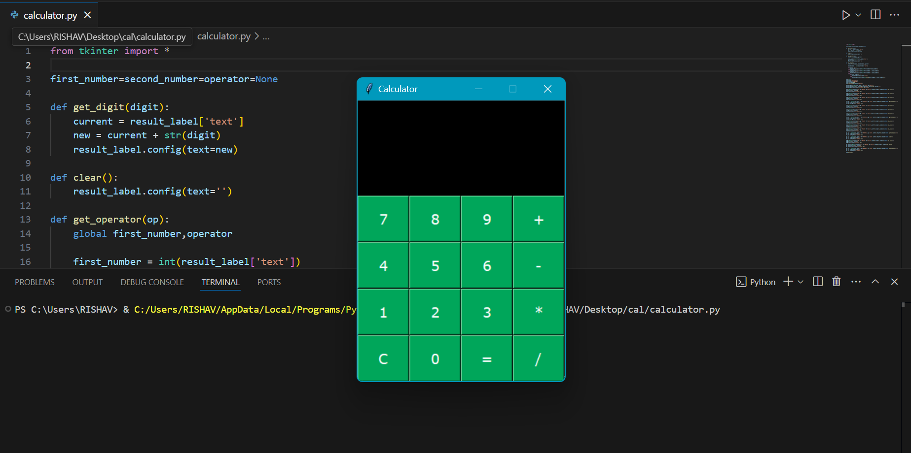

# Simple-GUI-Calculator
Developed a simple calculator with GUI using tkinter

---
## ✨Features
- **Basic Arithmetic Operations: Addition (+), Subtraction (-), Multiplication (*), Division (/)**
- **Error Handling:Division by zero is handled gracefully, displaying an "Error" message.**
- **Clear Functionality:The C button clears the current input.**
- **Responsive Buttons:Buttons for digits 0-9 and operators have intuitive placements.**
- **Responsive Design:A modern, styled interface with buttons colored and spaced for ease of use.**

## ⚙️Installation
 - **1. Install Python: Ensure Python is installed on your system. Download it from Python's official website.**
 - **2. Install Tkinter: Tkinter comes pre-installed with Python on most systems. If it's missing, install it using**
   - **Tkinter comes pre-installed with Python on most systems. If it's missing, install it using:**
     ```bash
     sudo apt-get install python3-tk  # For Ubuntu/Linux
     ```
     ```bash
     pip install tk  # For Windows/Mac (rarely required)
     ```

---
## Usage
1. **Copy and paste the provided code into a Python script file, e.g., guiCalculator.py.**
2. **Run the script:**
   ```bash
   python guiCalculator.py
   ```
3. **Use the calculator by clicking on buttons for digits, operators, and actions.**
4. **The result will be displayed in the entry field after pressing "=". Use "C" to clear.**

**This application is suitable for quick and simple calculations with an appealing interface.**

---

## 🖼Screenshot
### UI of Calculator


## Author
Developed by [Rishav](https://github.com/rishav0821).

---

